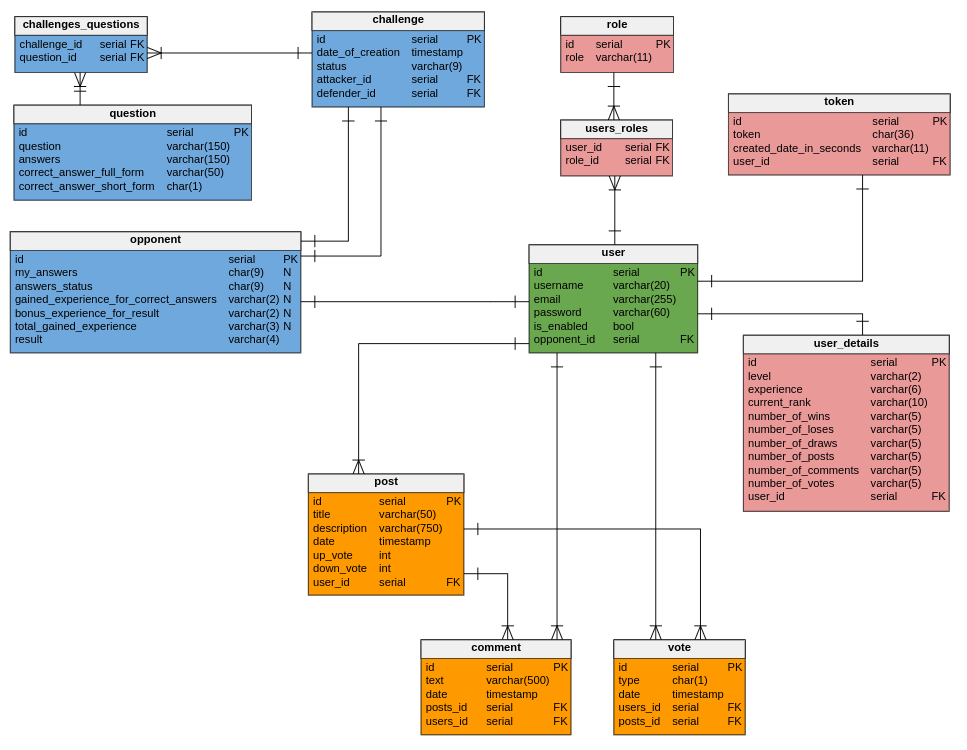

## Learn English Platform

### Table of Contents <hr/>
* [General info](#general-info)
* [Technologies](#technologies)
* [Prerequisites](#prerequisites)
* [Getting Started](#getting-started)
* [Tests](#tests)
* [API](#api)
* [Database schema](#database-schema)
* [Accounts](#accounts)
* [Features](#features)

### General info

This project is a small platform for learning english.<br>
I created this web application, because I wanted to learn basics of Angular and improve my Java skills.<br>

### Technologies

<b>Back-end</b>
* Java 11
* Maven
* Spring (Boot, Data, Validation, Security)
* Hibernate
* JPA
* PostgreSQL
* Lombok
* Guava: Google Libraries for Java
* SMTP protocol
* SLF4J
* Swagger

<b>Front-end</b>
* Angular 7
* Angular Material
* Bootstrap 4
* SweetAlert

<b>Tests</b>
* Kotlin
* JUnit 5 Jupiter

<b>Tools</b>
* Intellij IDEA
* DataGrip
* pgAdmin
* Postman

### Prerequisites

* Java 11
* Maven
* Node.js
* PostgreSQL

### Getting Started

To install this web application, you need to create following PostgreSQL database:
> <b>schema name:</b> <i>rest-project</i> <br>
  <b>username:</b> <i>postgres</i> <br>
  <b>password:</b> <i>admin</i> 
  
After that, run the following commands:

```bash
git clone https://github.com/RobertKrzywina/Learn-English-Web-Application.git
cd Learn-English-Web-Application
```

This will get a copy of the project installed locally. To install all of its dependencies and start each app, follow the instructions below.

To run the server, cd into the `server` folder and run:
 
```bash
./mvnw spring-boot:run
```

To run the client, cd into the `client` folder and run:
 
```bash
npm install && npm start
```

Default running ports: 
* server: 8080
* client: 4200

### Tests

Run all tests with FeatureTestSuite.kt class in src/test/kotlin/pl.robert.api

### API

API can be found at: http://localhost:8080/swagger-ui.html

### Database schema



### Accounts

|     Login        |    Password    |      Role       |
| :--------------: | :-------------:| :-------------: |
| a                | a              |  User, Admin    |
| b                | b              |  User           |
| BillGates        | c              |  User           |
| MarkZuckerberg   | d              |  User           |
| LinusTorvalds    | e              |  User           |
| GeorgeHotz       | f              |  User           |
| JamesGosling     | g              |  User           |
| Rob              | h              |  User           |
| SteveJobs        | i              |  User           |
| Fresh            | j              |  User           |

### Features

<b>General</b>
- [x] in data.sql script, there is a fake data which is implemented everytime when you run server
- [x] application uses 2 roles: user and admin, that means admin account has admin-panel for managing other users
- [x] not authenticated user can create and recover account, see posts and comments of other people
- [x] after success registration, server automatically sends verification token to given email
- [x] verification token expires after 15 min, you need to confirm it, othervise you won't be able to log into created account
- [x] authenticated user can create posts and comments, vote posts, see own and other profiles, challenge other people
- [x] application uses 7 ranks: Bronze, Silver, Gold, Platinum, Diamond, Master, Challenger
- [x] new created account starts with Bronze rank
- [x] user can improve his rank by adding posts, comments or challenging other users

<b>Challenges system</b>
- [x] in Database there are over 100 questions
- [x] each challenge contains 5 random questions with a, b, c, d options to answer
- [x] challenged person can accept or decline challenge
- [x] chosen rival get the same questions as you had
- [x] after completed challenge, both of users can see details about questions, which they answered and which are correct

<b>Experience</b>
- [x] add post gives 40 experience
- [x] add comment gives 20 experience
- [x] each correct question of challenge gives 15 experience
- [x] won challenge gains experienceForCorrectAnswers * 2 experience
- [x] lost challenge gains experienceForCorrectAnswers + 1 experience
- [x] draw challenge gains experienceForCorrectAnswers + 10 experience
